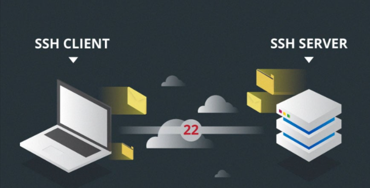

# Funcionamiento protocolo SSH con técnicas de cifrado.
- La forma en que funciona SSH es mediante 
    - El **uso de un modelo cliente-servidor** para permitir la autenticación de dos sistemas remotos 
    - Y el **cifrado de los datos** que pasa entre ellos.

- **SSH opera en el puerto TCP 22 de forma predeterminada** (aunque esto se puede cambiar si es necesario). 
- El **host (servidor) escucha en el puerto 22** (o cualquier otro puerto SSH asignado) para las conexiones entrantes. 
- Organiza la conexión segura mediante la **autenticación del cliente y la apertura del entorno de shell correcto si la verificación tiene éxito**.

    

- El cliente debe iniciar la conexión SSH 
    - iniciando el protocolo TCP con el servidor
        - asegurando una conexión simétrica segura
        - verificando si la identidad mostrada por el servidor coincide con los registros anteriores (normalmente grabados en un archivo de almacén de claves RSA) 
        - presenta las credenciales de usuario necesarias para autenticar la conexión.

- Hay dos etapas para establecer una conexión: 
    - primero ambos sistemas deben acordar estándares de cifrado para proteger futuras comunicaciones
    - el usuario debe autenticarse.
- **Si las credenciales coinciden, se concede acceso al usuario.**

## Negociación de cifrado se sesión

- Cuando un cliente intenta conectarse al servidor a través de TCP, el servidor presenta los protocolos de cifrado y las versiones respectivas que soporta. 
    - Si el cliente tiene un par similar de protocolo y versión, se alcanza un acuerdo y se inicia la conexión con el protocolo aceptado. 
    - El servidor también utiliza una clave pública asimétrica que el cliente puede utilizar para verificar la autenticidad del host.

- Una vez que esto se establece, las dos partes usan lo que se conoce como **Algoritmo de Intercambio de Claves Diffie-Hellman** para crear una clave simétrica. 
    - Este algoritmo permite que tanto el cliente como el servidor lleguen a una clave de cifrado compartida que se utilizará en adelante para cifrar toda la sesión de comunicación.

- **Cómo el algoritmo trabaja en un nivel muy básico**

    1. Tanto el cliente como el servidor coinciden en un número primo muy grande, que por supuesto no tiene ningún factor en común. Este valor de número primo también se conoce como el `valor semilla (seed value)`.

    2. Luego, las dos partes acuerdan un mecanismo de cifrado común para generar otro conjunto de valores manipulando los valores semilla de una manera algorítmica específica. Estos mecanismos, también conocidos como generadores de cifrado, realizan grandes operaciones sobre la semilla. Un ejemplo de dicho generador es AES (Advanced Encryption Standard).

    3. Ambas partes generan independientemente otro número primo. Esto se utiliza como una clave privada secreta para la interacción.

    4. Esta clave privada recién generada, con el número compartido y el algoritmo de cifrado (por ejemplo, AES), se utiliza para calcular una clave pública que se distribuye a la otra computadora.

    5. A continuación, las partes utilizan su clave privada personal, la clave pública compartida de la otra máquina y el número primo original para crear una clave compartida final. Esta clave se calcula de forma independiente por ambos equipos, pero creará la misma clave de cifrado en ambos lados.

    6. Ahora que ambas partes tienen una clave compartida, pueden cifrar simétricamente toda la sesión SSH. La misma clave se puede utilizar para cifrar y descifrar mensajes (leer: sección sobre cifrado simétrico).

- Ahora que se ha establecido la sesión cifrada segura simétricamente, el usuario debe ser autenticado.

## Autenticación del usuario.

- La **etapa final** antes de que se conceda al usuario acceso al servidor es la **autenticación de sus credenciales**. 
    - La mayoría de los usuarios de SSH utilizan una contraseña. 
    - Se le pide al usuario que introduzca el nombre de usuario, seguido de la contraseña. 
    - Estas credenciales pasan con seguridad a través del túnel cifrado simétricamente, así que no hay ninguna posibilidad de que sean capturadas por un tercero.

- Aunque las contraseñas se cifran, todavía no se recomienda usar contraseñas para conexiones seguras. 
    - Esto se debe a que muchos robots pueden simplemente realizar ataque de fuerza bruta para descifrar contraseñas fáciles o predeterminadas y así obtener acceso a tu cuenta. 
    - En vez de eso, la alternativa recomendada es un par de claves SSH.

- Se trata de un conjunto de claves asimétricas utilizadas para autenticar al usuario sin necesidad de introducir ninguna contraseña.