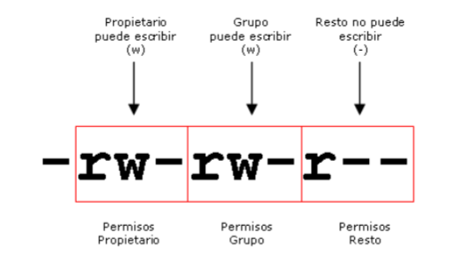
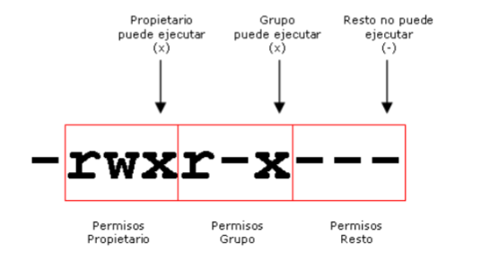
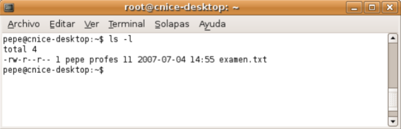
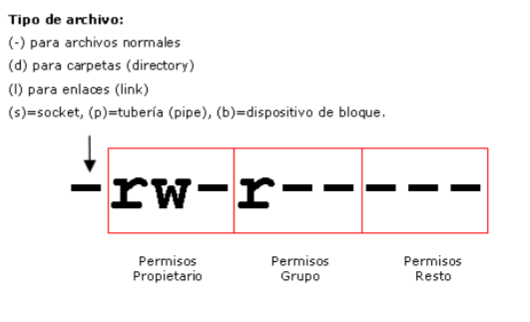
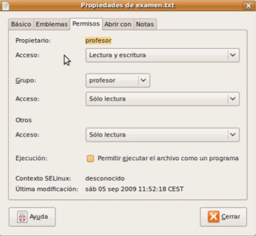

# Gestión de permisos en GNU/Linux

## Permisos de archivos y directorios

### Usuario propietario y grupo propietario de un archivo
- En Unix todos los archivos pertenecen obligatoriamente a un 
usuario y a un grupo. 
- Cuando un usuario crea un nuevo archivo, el propietario del archivo será el usuario que lo ha creado y el grupo del archivo será el grupo principal de dicho usuario.
- Ejemplo, si un usuario llamado 'pepe' cuyo grupo principal es el grupo 'profesores' crea un nuevo archivo:
    - El propietario del archivo será 'pepe' 
    - El grupo propietario del archivo será 'profesores'
    - Es decir, el archivo pertenecerá al usuario pepe y al grupo profesores. 
    - Obligatoriamente, todos los archivos del sistema pertenecen a algún usuario y a algún grupo. 
- Con el `comando ls` añadiendo la opción `-l` (formato largo) podemos visualizar el usuario propietario y el grupo propietario del archivo.

---

### Tipos de permisos
- En los Sistemas Unix, la gestión de los permisos que los usuarios y los grupos de usuarios tienen sobre los archivos y las carpetas, se realiza mediante un sencillo esquema de tres tipos de permisos que son:  
    - Permiso de lectura 
    - Permiso de escritura 
    - Permiso de ejecución

---

#### Permiso de lectura
- Cuando un usuario tiene permiso de lectura de un archivo significa que puede **leerlo o visualizarlo**, bien sea con una aplicación o mediante comandos. 
- Ejemplo, si tenemos permiso de lectura sobre el archivo examen.txt
    - Significa que podemos ver el contenido del archivo. 
    - Si el usuario no tiene permiso de lectura, no podrá ver el contenido del archivo.
- Cuando un usuario tiene permiso de lectura de una carpeta, significa que puede visualizar el contenido de la carpeta. Puede ver los archivos y carpetas que contiene:
    - Bien sea con el `comando 'ls'` 
    - O con un explorador de archivos como Konqueror. 
    - Si el usuario no tiene permiso de lectura sobre la carpeta, no podrá ver lo que contiene. 
- **El permiso de lectura se simboliza con la letra 'r' del inglés 'read'.**

    
    
---

#### Permiso de escritura
- Cuando un usuario tiene permiso de escritura sobre un archivo significa que puede **modificar** su contenido, e **incluso borrarlo**. 
- También le da derecho a cambiar los permisos del archivo mediante el 
`comando chmod` así como cambiar su propietario y el grupo propietario mediante el comando chown. 
- Si el usuario no tiene permiso de escritura, no podrá modificar el contenido del archivo.
- Cuando un usuario tiene permiso de escritura sobre una carpeta, significa que puede modificar el contenido de la carpeta:
    - Puede crear y eliminar archivos y otras carpetas dentro de ella. 
    - Si el usuario no tiene permiso de escritura sobre la carpeta, no podrá crear ni eliminar archivos ni carpetas dentro de ella.
- **El permiso de escritura se simboliza con la letra 'w' del inglés 'write'.**

    

---

#### Permiso de ejecución
- Cuando un usuario tiene permiso de ejecución de un archivo significa que puede **ejecutarlo**. 
- Si el usuario no dispone de permiso de ejecución, no podrá ejecutarlo aunque sea una aplicación.
- **Los únicos archivos ejecutables son las aplicaciones y los archivos de comandos (scripts).**
    - Si tratamos de ejecutar un archivo no ejecutable, dará errores.
- Cuando un usuario tiene permiso de ejecución sobre una carpeta:
    - Significa que puede entrar en ella    
        - bien sea con el `comando 'cd' `
        - O con un explorador de archivos como Konqueror. 
    - Si no dispone del permiso de ejecución significa que no puede ir a dicha carpeta.
- **El permiso de ejecución se simboliza con la letra 'x' del inglés 'eXecute'.**  

    

---

### ¿A quién se puede otorgar permisos?
- Los permisos solamente pueden ser otorgados a tres tipos o grupos de usuarios:  
    - Al usuario propietario del archivo 
    - Al grupo propietario del archivo 
    - Al resto de usuarios del sistema (todos menos el propietario)
- Se pueden dar permisos de **lectura, escritura, ejecución** ó **combinación de ambos**:
    - Al usuario propietario 
del archivo
    - Al grupo propietario del archivo 
    - Al resto de usuarios del sistema. 
- En Unix no existe la posibilidad de **asignar permisos** a usuarios concretos ni a grupos concretos, tan solo se puede asignar permisos al usuario propietario, al grupo propietario o al resto de usuarios.
- Ejemplo, si disponemos de un archivo llamado 'examen.txt' cuyo propietario es 'pepe' y cuyo grupo propietario es 'profesores':
    - Se pueden dar permisos de lectura, escritura, ejecución ó combinación de ambos al usuario 'pepe', al grupo 'profesores' y al resto de usuarios
    - Pero no podremos dar permisos a otros usuarios distintos de pepe (juan, luis, pedro,...) ni a otros grupos (alumnos, directivos, personal,...) ya que el esquema Unix no lo permite.
- Para poder cambiar permisos sobre un archivo, es necesario poseer el permiso de escritura sobre el mismo. 
- El `usuario root` puede modificar los permisos de cualquier archivo ya que tiene acceso total sin restricciones a la administración del sistema.

---

### Visualizar los permisos de un archivo o carpeta
- Con el `comando ls -l` podemos visualizar los permisos de los archivos o carpetas. 
- Al ejecutar el comando aparecen todos los archivos, uno por línea. 
- El bloque de 10 caracteres del principio simboliza el tipo de archivo y los permisos.

    

- Permisos de archivo
    - El primer carácter indica de qué tipo de archivo se trata. 
    - Si es un `guión '-'` significa que se trata de un archivo normal.
    - La `letra 'd'` significa que se trata de una carpeta (directory)
    - La `letra 'l'` significa que se trata de un enlace (link). 
    - Otros valores son `s, p, b` que se refieren a sockets, tuberías (pipe) y dispositivos de bloque respectivamente.
    - Los *9 caracteres siguientes* simbolizan:
        - los permisos del usuario propietario (3 caracteres)
        - los permisos del grupo propietario (3 caracteres)
        - y los permisos del resto de usuarios (3 caracteres). 
    - Vienen codificados con las letras `r, w y x` que se refieren a los permisos de lectura, escritura y ejecución. 
    - Si en lugar de aparecer dichas letras aparecen guiones significa que se carece de dicho permiso. 
    - Ejemplo, si los diez primeros caracteres son `-rw-r-----` significa que:
        - es un archivo normal
        - el usuario propietario dispone de permisos de lectura y escritura pero no de ejecución
        - el grupo propietario dispone tan solo de permiso de lectura y el resto de usuarios no dispone de ningún permiso.
    - Veámoslo en la siguiente imagen: 

        

---

### Cambio de permisos
- Para cambiar los permisos de un archivo o una carpeta es necesario disponer del permiso de **escritura (w)** sobre dicho archivo o carpeta. 
- Para hacerlo, se utiliza el `comando chmod`. 
- La sintaxis del comando chmod es la siguiente: 
    - `chmod [opciones] permiso nombre_archivo_o_carpeta`
- Los permisos se pueden representar de dos formas.
    - La **primera** es mediante las iniciales de a quién va dirigido el permiso `(usuario=u, grupo=g, resto=o (other))`, seguido de un `signo +` si se quiere añadir permiso o un `signo -` si se quiere quitar y seguido del tipo de permiso `(lectura=r, escritura=w y ejecución=x)`. 
        - Ejemplos: 
            ```bash
            // Dar permiso de escritura al usuario propietario sobre el archivo 'examen.txt' 
            # chmod u+w examen.txt 
            
            // Quitar permiso de escritura al resto de usuarios sobre el archivo 'examen.txt' 
            # chmod o-w examen.txt 
            
            // Dar permiso de ejecución al grupo propietario sobre el archivo '/usr/bin/games/tetris' 
            # chmod g+x /usr/bin/games/tetris 
            
            // Dar permiso de lectura al grupo propietario sobre el archivo 'examen.txt' 
            # chmod g+r examen.txt 
            
            // Se pueden poner varios permisos juntos separados por comas 
            # chmod u+w,g-r,o-r examen.txt 
            
            // Se pueden poner varios usuarios juntos 
            # chmod ug+w examen.txt 
            ```
    - La **segunda** forma de representar los permisos es mediante un código numérico cuya transformación al binario representaría la activación o desactivación de los permisos. 
        - El código numérico está compuesto por tres cifras entre 0 y 7. 
            - La primera de ellas representaría los permisos del usuario propietario
            - La segunda los del grupo propietario 
            - La tercera los del resto de usuarios.
        - En **binario**, las combinaciones representan el tipo de permisos. 
            - El `bit más a la derecha` (menos significativo) se refiere al permiso de ejecución `(1=activar y 0=desactivar)`. 
            - El `bit central` se refiere al `permiso de escritura` 
            - El `bit más a la izquierda` se refiere al `permiso de lectura`. 
        - La siguiente tabla muestra las 8 combinaciones posibles:
            | Cód | Binario | Permisos efectivos | Descripción                                  |
            |-----|---------|--------------------|----------------------------------------------|
            | 0   | 0 0 0   | - - -              | Quitar todos los permisos                    |
            | 1   | 0 0 1   | - - x              | Otorgar sólo permiso de ejecución            |
            | 2   | 0 1 0   | - w -              | Otorgar sólo permiso de escritura            |
            | 3   | 0 1 1   | - w x              | Otorgar permiso de escritura y ejecución     |
            | 4   | 1 0 0   | r - -              | Otorgar sólo permiso de lectura              |
            | 5   | 1 0 1   | r - x              | Otorgar permiso de lectura y ejecución       |
            | 6   | 1 1 0   | r w -              | Otorgar permiso de lectura y escritura       |
            | 7   | 1 1 1   | r w x              | Otorgar todos los permisos                   |

            
        - Ejemplos:
            ```bash
            / Dar todos los permisos al usuario y ninguno ni al grupo ni al resto 
            chmod 700 examen.txt 
            
            // Dar al usuario y al grupo permisos de lectura y ejecución y ninguno al resto 
            chmod 550 examen.txt 
            
            // Dar todos los permisos al usuario y lectura y ejecución al grupo y al resto 
            chmod 755 /usr/bin/games/tetris 
            
            // Dar todos los permisos al usuario y de lectura al resto, sobre todos los archivos 
            chmod 744 * 
            
            // Cambiar permisos a todos los archivos incluyendo subcarpetas 
            chmod -R 744 *
            ```
    - Existe la posibilidad de cambiar los permisos utilizando el explorador de archivos. 
        - Para ello tan solo hay que seleccionar los archivos o carpetas y haciendo clic sobre la selección con el botón derecho del ratón `> Propiedades`, nos aparecerá la ventana de propiedades. 
        - Haciendo clic en la pestaña `Permisos` podremos establecer los permisos de una forma sencilla y haciendo clic en `Permisos avanzados` de una forma avanzada.

            

---
