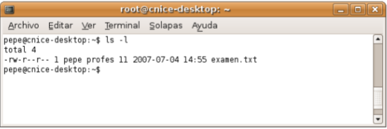
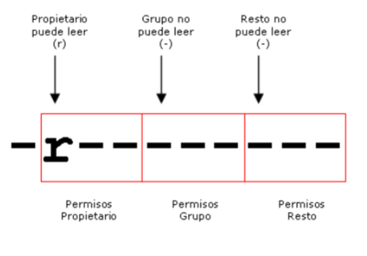

# Gestión de permisos en GNU/Linux

## Permisos de archivos y directorios

### Usuario propietario y grupo propietario de un archivo
- En Unix todos los archivos pertenecen obligatoriamente a un 
usuario y a un grupo. 
- Cuando un usuario crea un nuevo archivo, el propietario del archivo será el usuario que lo ha creado y el grupo del archivo será el grupo principal de dicho usuario.
- Ejemplo, si un usuario llamado 'pepe' cuyo grupo principal es el grupo 'profesores' crea un nuevo archivo:
    - El propietario del archivo será 'pepe' 
    - El grupo propietario del archivo será 'profesores'
    - Es decir, el archivo pertenecerá al usuario pepe y al grupo profesores. 
    - Obligatoriamente, todos los archivos del sistema pertenecen a algún usuario y a algún grupo. 
- Con el `comando ls` añadiendo la opción `-l` (formato largo) podemos visualizar el usuario propietario y el grupo propietario del archivo, ejemplo:

    

---

### Tipos de permisos
- En los Sistemas Unix, la gestión de los permisos que los usuarios y los grupos de usuarios tienen sobre los archivos y las carpetas, se realiza mediante un sencillo esquema de tres tipos de permisos que son:  
    - Permiso de lectura 
    - Permiso de escritura 
    - Permiso de ejecución

#### Permiso de lectura
- Cuando un usuario tiene permiso de lectura de un archivo significa que puede leerlo o visualizarlo, bien sea con una aplicación o mediante comandos. 
- Ejemplo, si tenemos permiso de lectura sobre el archivo examen.txt
    - Significa que podemos ver el contenido del archivo. 
    - Si el usuario no tiene permiso de lectura, no podrá ver el contenido del archivo.
- Cuando un usuario tiene permiso de lectura de una carpeta, significa que puede visualizar el contenido de la carpeta. Puede ver los archivos y carpetas que contiene:
    - Bien sea con el comando 'ls' 
    - O con un explorador de archivos como Konqueror. 
    - Si el usuario no tiene permiso de lectura sobre la carpeta, no podrá ver lo que contiene. 
- **El permiso de lectura se simboliza con la letra 'r' del inglés 'read'.**

    
    
#### Permiso de escritura