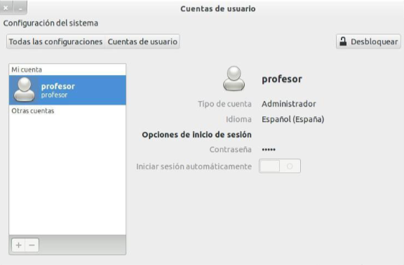
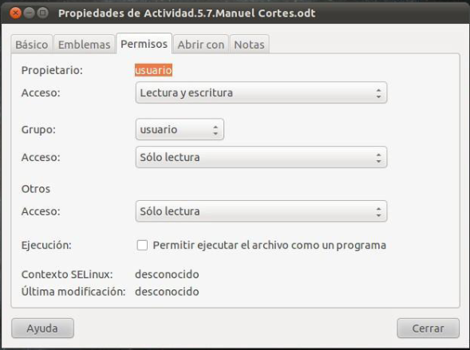

# Gestión de usuarios, grupos y permisos en GNU/Linux

## Introducción
- Linux es un sistema multiusuario por lo que puede tener varios usuarios
trabajando en el sistema al mismo tiempo.
- Los usuarios deben pertenecer como mínimo a un grupo, pudiendo
pertenecer a más de un grupo.
- Para entrar en un sistema GNU/Linux es necesario identificarse con un
usuario válido.
- Los usuarios se identifican internamente a través de un UID
(Identificador de usuario).
- El UID es un número único para cada usuario del sistema.
- Cada usuario tiene que pertenecer obligatoriamente a un grupo grupo
primario o principal y además puede pertenecer a otros grupos
secundarios.
- Un grupo es un conjunto de usuarios y puede haber grupos que
contengan únicamente un usuario.
- Cada grupo se identifica en el sistema a través del GID (Identificador de
grupo)
- El GID es un número único para cada grupo del sistema.

---

## Tipos de usuarios

En Linux podemos distinguir 3 tipos de usuarios:
- `Usuario Root`
    - También denominado superusuario o administrador del sistema
    - Cuenta con todos los privilegios sobre el sistema, teniendo acceso total al mismo,tanto de administración, actualización y mantenimiento del sistema.
    - Se identifica por su UID que es el 0 (cero).
    - Su directorio casa o “home” es /root

- `Usuarios de sistema`
    - No son usuarios físicos, sino que se generan al instalar el sistema o cualquier programa o servicio.
    - No tienen todos los privilegios, pero si algunos especiales.
    - No son usuarios que puedan entrar al sistema y no pueden iniciar una sesión.
    - Para estos usuarios se reserva el UID desde el 1 al 999, salvo para el usuario nobody que se le asigna el último UID posible, el 65.534

- `Usuarios normales`
    - Son los usuarios que entran al sistema introduciendo su nombre de usuario y contraseña.
    - Tienen por defecto un directorio de trabajo (directorio personal) dentro del directorio /home, que es a partir del cual el usuario puede trabajar y tiene todos los privilegios.El UID que se le asigna es a partir del 1000.
    - Al instalar el sistema operativo se crea un usuario por defecto durante el proceso de instalación.
    - Si en el sistema sólo hay un usuario normal podemos configurarlo para que no pida su usuario y contraseña y que entre directamente como este usuario.

##  Ficheros de configuración de usuarios y grupos
- Ficheros que el sistema lee o modifica al gestionar usuarios o grupos
- Los más importantes son:

    - `/etc/passwd`
        - Cada una de las líneas de este fichero de texto representa la información de un usuario.
        - La información se organiza en campos separados por el carácter “:”.
        - Los campos de cada línea son:
        - `<nombre_usuario>:x:<UID>:<GID>:<información_usuario>:<directorio_personal>:<shell_de_inicio>`
        - Ejemplo: `profesor:x:1000:1000:profesor,,,:/home/profesor:/bin/bash`

    - `/etc/shadow`
        - Almacena las contraseñas encriptadas de cada usuario.
        - Sólo se puede acceder a este fichero como root o con privilegios de administrador (sudo).
        - En versiones antiguas de Linux, la contraseña del usuario se guardaba en el fichero /etc/passwd en lugar de la “x”, pero en versiones más recientes las contraseñas se almacenan en este fichero con diferentes tipos de encriptación:
        - **MD5**: $1$ Sin encriptación
        - **SHA256**: $5$ 256 bits
        - **SHA512**: $6$ 512 bits
        - Los campos almacenados en este fichero son:
        - `<nombre_usuario>:<contraseña_encriptada>:<numero_dias_sin_cambiar_clave>:...`

    - `/etc/group`
        - En este fichero se encuentran los grupos de usuarios definidos en el sistema.
        - Cada línea contiene la siguiente información:
        - `<nombre_grupo>:<contraseña_grupo_x=notiene>:<GID>:<lista_usuarios_separados_por_comas>`

---

- Otros ficheros importantes en la gestión de usuarios y grupos

| Fichero                  | Función                                                                 |
|--------------------------|-------------------------------------------------------------------------|
| /etc/gshadow             | Almacena las contraseñas de los grupos y sólo el root puede visualizarlo. |
| /etc/default/useradd     | Contiene valores por defecto a la hora de añadir un usuario con el comando `useradd`. |
| /etc/adduser.conf        | Guarda los valores por defecto que se le dan a un nuevo usuario cuando se crea con el comando `adduser`. |
| /etc/deluser.conf        | Guarda los valores por defecto cuando se elimina un usuario con el comando `deluser`. |
| /etc/shells              | Contiene una lista de los shells válidos.                                |

---

## Gestión de usuarios y grupos en modo gráfico

- Para gestionar usuarios y grupos en modo gráfico en Ubuntu:
    - Aplicaciones → Herramientas del Sistema → Configuración del Sistema → Cuentas de Usuario
    - Aplicaciones → Herramientas del Sistema → Administración → Usuarios y Grupos

        

- Desde esta aplicación podemos crear nuevos usuarios,eliminarlos y gestionar los grupos, creándolos, eliminándolos e incluyendo usuarios nuevos en los grupos ya existentes.

---

## Gestión de grupos y usuarios en modo texto

### Comandos útiles
- `Comando Sudo`
    - Permite ejecutar comandos como si fuéramos el superusuario o ROOT.
    - Para utilizarlo es necesario que el usuario deba estar configurado con privilegios de root o administrador, para ello debe pertenecer al grupo “sudo”, o configurarlo en el fichero /etc/sudoers.

- `Comando su`
    - Cambia de usuario o nos permite ser el superusuario.
    - Si no indicamos ningún usuario, nos cambiaremos al superusuario root.
    - Sintaxis:

    | Comando              | Función                                                                          |
    |----------------------|----------------------------------------------------------------------------------|
    | su <nombre_usuario>  | Cambia de usuario a `<nombre_usuario>` pero no carga su configuración personal   |
    | su - <nombre_usuario> | Cambia de usuario a `<nombre_usuario>` pero sí carga su configuración personal  |
    | su                   | Cambia al superusuario o root, pero no carga la configuración de root            |
    | su -                 | Cambia al superusuario o root, pero sí carga la configuración de root            |

- `Comando exit o (Ctrl + D)`
    - Sale o termina la sesión del usuario con el que estamos logueados en el sistema.

---

### Comandos para la gestión de usuarios y grupos

- Hay que tener en cuenta que sólo el administrador o un usuario con permisos de administrador puede añadir o modificar usuarios y grupos, por lo que es necesario el uso del comando sudo para realizar este tipo de operaciones.ç

- `Comando adduser`
    - Tiene 2 funciones:
        - Añadir un nuevo usuario al sistema, generando por defecto lo siguiente:
            - Un nuevo usuario
            - Un grupo del mismo nombre
            - Una carpeta personal, en /home, llamada igual que el nuevo usuario
    - Añadir un usuario existente a un grupo también existente en el sistema, de forma que dicho usuario tendrá ese grupo como grupo secundario.
    - Sintaxis:

        | Comando                                       | Funciones                                                         |
        |-----------------------------------------------|-------------------------------------------------------------------|
        | adduser [opciones] <usuario_nuevo>            | Crea un nuevo usuario                                             |
        | adduser <usuario_existente> <grupo_existente> | Añade un usuario existente a un grupo existente                   |

        | Opciones                 | Función                                                                                     | Ejemplo                           |
        |--------------------------|---------------------------------------------------------------------------------------------|-----------------------------------|
        | --ingroup <grupo_existente> | Sirve para añadir un nuevo usuario, pero en lugar de crearle un grupo con su mismo nombre lo añade al grupo existente que se le indica | adduser usu3 --ingroup usuario    |
        | --home <directorio_personal> | Esto hace que el nuevo usuario tenga como carpeta personal la que le indiquemos               | adduser usu4 --home /home/otros   |

---

- `Comando deluser`
    - Elimina un usuario del sistema, pero dicho usuario no puede estar conectado en ese momento al sistema.
    - Sintaxis:
        - `deluser [opciones] <nombre_usuario>`
    - Opciones:
        - `- - remove-home`
            - Borra el fichero personal del usuario
        - `- - remove-all-files`
            - Elimina todos los ficheros que pertenecen al usuario

---

- `Comando passwd`
    - Establece una contraseña para el usuario especificado.
    -  Es necesario, para poder acceder con un usuario al sistema, que éste tenga una contraseña o password
    - Sintaxis:
        - `passwd <nombre_usuario>`

---

- `Comando addgroup`
    - Añade un nuevo grupo al sistema.
    - Sintaxis:
        - `addgroup <nuevo_grupo>`

---

- `Comando delgroup`
    - Elimina un grupo del sistema
    - Sólo se puede eliminar un grupo si no es grupo primario o principal de algún usuario.
    - Sintaxis
        - `delgroup <nombre_grupo>`

---

- `Comando Usermod`
    - Modifica datos de un usuario existente.
    - Sintaxis
        - `usermod [opciones] <nombre_usuario>`

            | Opciones               | Función                                       |
            |------------------------|-----------------------------------------------|
            | -d <nombre_directorio> | Cambia el directorio personal del usuario     |
            | -g <nombre_grupo>      | Cambia el grupo primario del usuario          |
            | -u <número_uid>        | Cambia el UID del usuario                     |
            | -l <nuevo_nombre>      | Cambia el nombre del usuario                  |

---

- `Comando groupmod`
    - Modifica datos de un grupo existente.
    - Sintaxis
        - `groupmod [opciones] <nombre_grupo>`

            | Opciones           | Función                      |
            |--------------------|------------------------------|
            | -n <nombre_grupo>  | Modifica el nombre del grupo |
            | -g <número_GID>    | Modifica el GID del grupo    |

---

- `Comando id`
    - Muestra información sobre el usuario como el UID
        - nombre
        - grupo principal al que pertenece
        - grupos secundarios y sus correspondientes GID
    - Sintaxis
        - `id [opciones] <nombre_usuario>`

---

- `Comando groups`
    - Muestra el nombre de todos los grupos a los que pertenece el usuario.
    - Sintaxis
        - `groups <nombre_usuario>`

---

- `Comando chfn`
    - Cambia la información personal del usuario que aparece en un campo del fichero /etc/passwd.
    - Sintaxis
        - `chfn [-opciones] <nombre_usuario>`

---

-  `Comando finger`
    - Muestra información sobre el usuario
    - Si no se especifica ninguno muestra información de los usuarios conectados al sistema.
    - Sintaxis:
        - `finger <nombre_usuario>`

---

- `Comando useradd`
    - Permite crear usuarios en el sistema, similar al comando adduser
    - Este comando dispone de muchas opciones como establecer la fecha de expiración de la contraseña para el usuario, establecer comentarios cuando se loguea el usuario, establecer la fecha de expiración de la cuenta, ... Todas las opciones que proporciona este comando y cualquier otro se pueden consultar mediante el comando man.

        | Opción | Función                                                                                           |
        |--------|---------------------------------------------------------------------------------------------------|
        | -g     | Indica el grupo principal al que va a pertenecer el usuario creado                                |
        | -d     | Indica el directorio HOME que va a tener el usuario                                               |
        | -s     | El shell o conjunto de comandos que podrá ejecutar el usuario                                     |
        | -m     | Crea el directorio HOME del usuario si no existe                                                  |
        | -k     | Copia los ficheros y directorios del directorio /etc/skel                                         |
        | -p     | Establece la contraseña. El problema es que useradd -p establece la contraseña pero sin encriptar (adduser sí la encripta). Para solucionar esto, usaremos el comando passwd |

    - Es necesario crear antes el grupo al que va a pertenecer el usuario
        - `sudo addgroup >nombre_grupo>'`
    - Es necesario crear después la contraseña del usuario
        - `sudo passwd <nombre_usuario>`
    - Ejemplo:
        ```bash
        sudo addgroup usuarios
        sudo useradd -g usuarios -d /home/usuario2 -s /bin/bash -m -k /etc/skel usuario2
        sudo passwd usuario2
        ```

---

### Comandos para cambiar el propietario de ficheros y directorios

- En GNU/Linux todos los ficheros y directorios pertenecen a un usuario(propietario/owner) y a un grupo al que tiene que pertenecer dicho usuario.
-  GNU/Linux nos permite modificar el propietario y el grupo de los ficheros.

- `Comando chown`
    - Permite cambiar el propietario y el grupo al que pertenece un fichero o directorio.
    - Sintaxis:
        - `chown [opciones] <user>:<group> <filename>`
    - Opciones:
        - `-R`
            - Cambia el propietario y el grupo de forma recursiva, es decir, tanto al directorio como a todos sus subdirectorios y ficheros.
    - Ejemplo:
        - `chown alumno:alumno fichero.txt`
        - `chown -R alumno:alumno directorio`

---

- `Comando chgrp`
    - Cambia el grupo al que pertenece un fichero o directorio
    - Sintaxis:
        - `chgrp <nombre_grupo> <fichero/directorio>`
    - Ejemplos:
        - `sudo chgrp grupo1 texto.txt`
        - `sudo chgrp -R grupo1 directorio`

---

### Cambiar los permisos a ficheros y directorios
- Todos los archivos y directorios, como pertenecen a unos usuarios y grupos hacen necesario una política de permisos para manipularlos.
-  GNU/Linux utiliza 3 grupos de permisos:
    - Los permisos del propietario del archivo (u)
    - Los permisos de los usuarios que pertenecen al mismo grupo del propietario (g)
- Los permisos del resto de los usuarios (o)

    | Permisos     | Ficheros                                           | Directorios                                                  |
    |--------------|----------------------------------------------------|--------------------------------------------------------------|
    | Lectura (r)  | Poder ver su contenido                             | Poder listar su contenido                                    |
    | Escritura (w)| Poder modificar su contenido y/o eliminar el fichero| Poder crear/eliminar ficheros del directorio y/o el propio directorio |
    | Ejecución (x)| Significa que se trata de un ejecutable (fichero binario) o que contiene un grupo de comandos a ejecutar (shell script) | Poder entrar dentro de él                                    |

---    

#### Permisos en modo gráfico
- Para ver o cambiar los permisos de un fichero en modo gráfico haremos click con el botón derecho sobre el archivo, entraremos en propiedades y después seleccionaremos la pestaña permisos.

    

---

#### Permisos en modo texto
- Para comprobar los permisos de cualquier archivo en modo texto usaremos el comando ls -l

- `Comando chmod`
    - Este comando cambia los permisos de un archivo o directorio, así como del contenido de un directorio utilizando la opción -R (Recursivo)
- Sintaxis:
    - `chmod [permisos [permisos]...] archivos`
- Tipos de ficheros o directorios:
    - Al listar el contenidfo de un directorio mediante el comando “ls -l” se puede observar los siguientes campos divididos en columnas:
        - `-rw-rw-r--` 1 alumno alumno 11 ene 28 2014 texto.txt
    - `d`  → Indica que es un directorio
    - `-` → Indica que es un fichero regular
    - `l` → indica que es un enlace
- Permisos:
    - Los permisos se pueden añadir o quitar indicando lo siguiente:
        - chmod {a, u, g, o } {+ , - } { r, w, x, X} archivo/s.

    | Símbolo | Descripción                                                    |
    |---------|----------------------------------------------------------------|
    | **A quién se le va a cambiar el permiso**                                 |
    | u       | La “u” indica al usuario propietario                           |
    | g       | La “g” indica al grupo                                         |
    | o       | La “o” indica a los otros usuarios del sistema                 |
    | a       | La “a” indica a todos tipos de permisos                        |
    | **Indican si queremos añadir o suprimir un permiso**                      |
    | +       | Añadir permisos                                                |
    | -       | Eliminar permisos                                              |
    | =       | Se asignan los permisos independientemente de los permisos que tuviera anteriormente |
    | **Indican el permiso que queremos añadir o quitar**                       |
    | r       | Permisos de lectura                                            |
    | w       | Permisos de escritura o modificación                           |
    | x       | Permisos de ejecución                                          |
    | X       | Ejecución en caso de que sea un directorio                     |

---

- Ejemplos en ficheros:
    - `-rwx r-x r--` (permisos que hemos sacado de un fichero) `f1.txt`
    - `chmod u-x f1.txt`
    - Elimina el permiso de ejecución al usuario.
    - `chmod u+r, g+w f1.txt`
    - Asigna permiso de lectura al usuario y de escritura al grupo.
    - `chmod g-rwx f1.txt`
    - Elimina todos los permisos al grupo.
    - `chmod o-r, o+w f1.txt`
    - Elimina los permisos de lectura a otros, les añade permiso de escritura.
    - `chmod ugo-x texto.txt`
    - `chmod a=r-- texto.txt`
    - `chmod o=rx- texto.txt`
    - `chmod u+wx,g+w,o+w texto.txt`

- Ejemplos en directorios:
    - `chmod -R u=rwx,g=rw,o=r prueba`

- Sistema octal para modificación de permisos con `chmod`:
    - Linux admite otro formato de modificación de permisos mediante el comando `chmod`.
    - Utiliza el sistema octal (0 al 7) para dar o quitar permisos.
    - Con la opción `-R` podemos cambiar los permisos a un directorio y a todos los elementos que hay dentro de él de forma recursiva.

    - Sintaxis:
        - `chmod [0-7][0-7][0-7] <fichero>`
        - `chmod -R [0-7][0-7][0-7] <directorio>`
        - Significado de los dígitos octales:
            - El primer dígito octal indica los permisos del propietario (u)
            - El segundo dígito octal indica los permisos del grupo (g)
            - El tercer dígito octal indica los permisos del resto de usuarios (o)
            - El permiso de lectura (r) tiene un valor de 4
            - El permiso de escritura (w) tiene un valor de 2
            - El permiso de ejecución (x) tiene un valor de 1

    - Ejemplos:
        - `chmod 664 f1.txt`
        - `chmod -R 775 <directorio>`

---

- `Comando “ls -l”`
    - Al listar el contenido de un directorio mediante el comando “ls -l” se pueden observar los siguientes campos divididos en columnas:
    - `-rw-rw-r--` 1 alumno 2cf 11 ene 28 2014 texto.txt

        | Información      | Significado                                                                                      |
        |------------------|--------------------------------------------------------------------------------------------------|
        | -                | Indica el tipo de fichero que es:                                                                |
        |                  | ▪ `d` → Indica que es un directorio                                                              |
        |                  | ▪ `-` → Indica que es un fichero regular                                                         |
        |                  | ▪ `l` → Indica que es un enlace                                                                  |
        | rwxrw-r--        | Indica los permisos del fichero o directorio                                                     |
        | 1                | El número que indica el número de links al fichero                                               |
        | alumno           | El propietario                                                                                   |
        | 2cf              | El grupo al que pertenece                                                                         |
        | 11               | El tamaño en bytes                                                                               |
        | “ene 28 2014”    | La fecha de la última modificación                                                               |
        | Texto.txt        | El nombre del fichero (si es un link simbólico se muestra también el fichero al que hace referencia) |

---
