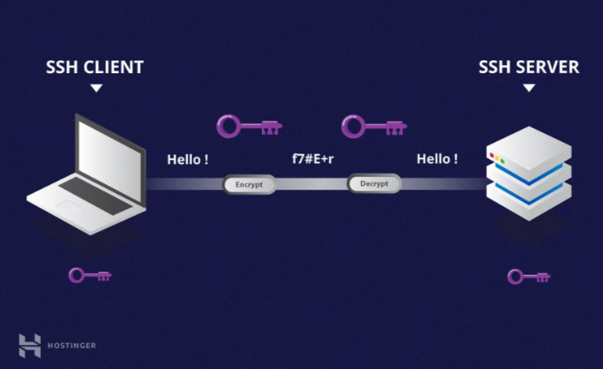
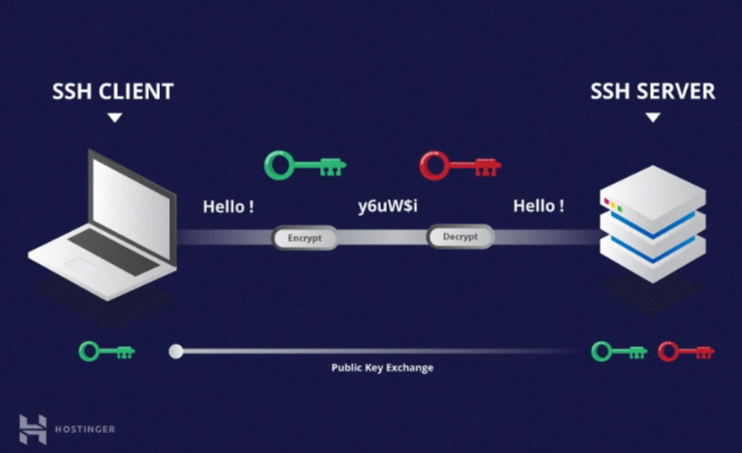
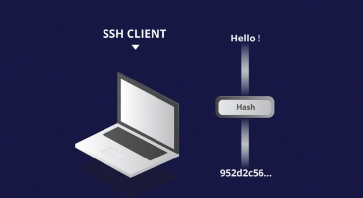

# Tipos de cifrado
La ventaja significativa ofrecida por el protocolo SSH sobre sus predecesores es el uso del cifrado para asegurar la transferencia segura de información entre el host y el cliente. 

Host se refiere al servidor remoto al que estás intentando acceder, mientras que el cliente es el equipo que estás utilizando para acceder al host. 

Hay tres tecnologías de cifrado diferentes utilizadas por SSH:
- [Cifrado simétrico](##Cifrado-simétrico)
- [Cifrado asimétrico](##Cifrado-asimétrico)
- [Hashing](##Hashing)

## Cifrado simétrico
- El cifrado simétrico es una forma de cifrado en la que se utiliza una clave secreta tanto para el cifrado como para el descifrado de un mensaje, tanto por el cliente como por el host. 
- Efectivamente, cualquiera que tenga la clave puede descifrar el mensaje que se transfiere.

    

- El **cifrado simétrico** a menudo se llama clave compartida `(shared key)` o cifrado secreto compartido. 
    - Normalmente sólo hay una clave que se utiliza, o a veces un par de claves donde una clave se puede calcular fácilmente con la otra clave.
    -  Las claves simétricas se utilizan para cifrar toda la comunicación durante una sesión SSH. 
    - Tanto el cliente como el servidor derivan la clave secreta utilizando un método acordado, y la clave resultante nunca se revela a terceros. 
- El proceso de creación de una clave simétrica se lleva a cabo mediante un algoritmo de intercambio de claves.
    - Lo que hace que este algoritmo sea particularmente seguro es el hecho de que la clave nunca se transmite entre el cliente y el host. 
    - En lugar de eso, los dos equipos comparten datos públicos  y luego los manipulan para calcular de forma independiente la clave secreta. 
    - Incluso si otra máquina captura los datos públicamente compartidos, no será capaz de calcular la clave porque el algoritmo de intercambio de clave no se conoce.

- Debe tenerse en cuenta, sin embargo, que el **token secreto** es **específico para cada sesión SSH**, y se genera antes de la autenticación del cliente. 
    - Una vez generada la clave, todos los paquetes que se mueven entre las dos máquinas deben ser cifrados por la clave privada. 
    - Esto incluye la contraseña escrita en la consola por el usuario, por lo que las credenciales siempre están protegidas de los fisgones de paquetes de red.

- Existen varios códigos cifrados simétricos
    - AES (Advanced Encryption Standard)
    - CAST128
    - Blowfish
    - etc. 
    
- Antes de establecer una conexión segura, el cliente y un host deciden qué cifrado usar, publicando una lista de cifrados soportados por orden de preferencia. 
- El cifrado preferido de entre los soportados por los clientes que está presente en la lista del host se utiliza como el cifrado bidireccional.

- Por ejemplo, si dos máquinas **Ubuntu 14.04 LTS** se comunican entre sí a través de SSH, utilizarán **aes128-ctr** como su cifrado predeterminado.

## Cifrado asimétrico
- A diferencia del cifrado simétrico, el **cifrado asimétrico** utiliza **dos claves separadas para el cifrado y el descifrado**.
- Estas **dos claves se conocen como la clave pública (public key)** y **la clave privada (private key)**. 
- Juntas, estas claves forman el **par de claves pública-privada (public-private key pair)**.

    

- La `clave pública`, como sugiere el nombre, se distribuye abiertamente y se comparte con todas las partes. 
    - Si bien está estrechamente vinculado con la clave privada en términos de funcionalidad, la clave privada no se puede calcular matemáticamente desde la clave pública. 
    - La relación entre las dos claves es altamente compleja
        - Un mensaje cifrado por la clave pública de una máquina, sólo puede ser descifrado por la misma clave privada de la máquina. 
        - Esta **relación unidireccional** significa que la clave pública **no puede descifrar sus propios mensajes** ni descifrar nada cifrado por la clave privada.

- La `clave privada` debe permanecer **privada**, es decir, para que la conexión sea asegura, **ningún tercero debe conocerla**. 
    - La **fuerza** de toda la conexión reside en el hecho de que la clave privada **nunca se revela**, ya que es el *único componente capaz de descifrar mensajes que fueron cifrados usando su propia clave pública*. 
    - Por lo tanto, cualquier parte con la capacidad de descifrar mensajes firmados públicamente debe poseer la clave privada correspondiente.

- A diferencia de la percepción general, el cifrado asimétrico no se utiliza para cifrar toda la sesión SSH. 
    - Sólo se utiliza durante el algoritmo de intercambio de claves de cifrado simétrico. 
    - Antes de iniciar una conexión segura, ambas partes generan pares de `claves públicas-privadas temporales` y **comparten sus respectivas claves privadas para producir la clave secreta compartida**.

- Una vez que se ha establecido una comunicación simétrica segura
    - El servidor utiliza la clave pública de los clientes para generar y desafiar y transmitirla al cliente para su autenticación. 
    - **Si el cliente puede descifrar correctamente el mensaje, significa que contiene la clave privada necesaria para la conexión**. Y entonces comienza la sesión SSH.

## Hashing

- El **hashing unidireccional** es otra forma de criptografía utilizada en *Secure Shell Connections*. 
- Las funciones de **hash unidireccionales** difieren de las dos formas anteriores de encriptación en el sentido de que **nunca están destinadas a ser descifradas**. 
- **Generan un valor único de una longitud fija** para cada entrada que no muestra una tendencia clara que pueda explotarse. **Esto los hace prácticamente imposibles de revertir.**

    

- Es **fácil generar un hash criptográfico de una entrada dada, pero imposible de generar la entrada del hash**. 
    - Esto significa que si un cliente tiene la entrada correcta, pueden generar el hash criptográfico y comparar su valor para verificar si poseen la entrada correcta.

- **SSH utiliza hashes para verificar la autenticidad de los mensajes**.    
    - Esto se hace usando HMACs, o códigos de autenticación de mensajes basados en hash. 
    - Esto asegura que el comando recibido no se altere de ninguna manera.

- Mientras se selecciona el algoritmo de cifrado simétrico, también se selecciona un algoritmo de autenticación de mensajes adecuado. 
    - Esto funciona de manera similar a cómo se selecciona el cifrado, como se explica en la sección de cifrado simétrico.

- **Todo mensaje transmitido debe contener** 
    - Un MAC, que se calcula utilizando la clave simétrica.
    - El número de secuencia de paquetes
    - El contenido del mensaje. 
- Se envía fuera de los datos cifrados simétricamente como la sección final del paquete de comunicaciones.